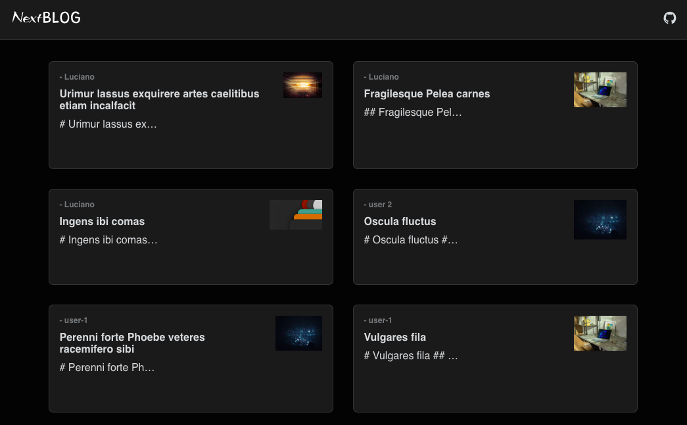

<h1 align="center">Next Blog</h1>

<h2 align=center>

</h2>

## `Preview`

## `Sobre o projeto`

Este projeto foi criado no curso de `JavaScript e TypeScript avançado`. Foi usado tecnologias modernas como `NextJS`, `TypeScript`, `Styled Components` e `Strapi`.

## `Tecnologias 🚀`

### `- Frontend`
- `NextJS`
- `ReactJS`
- `TypeScript`
- `JavaScript`
- `Styled Components`
- `Storybook`
- `Jest`
- `Testing-Library`
- `Disqus`
- `Remark`
- `React Icons`
- `NProgress`

### `- Backend`
- `Strapi`
- `Postgres`
- `Railway - para deploy`

---

[Demo ↗️](https://next-blog-lime-seven.vercel.app/)
